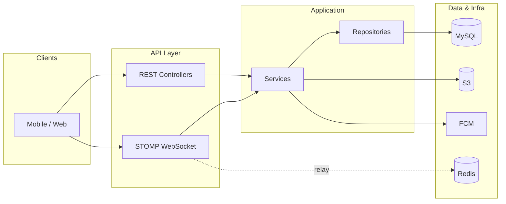

# 민턴 매치 API (Minton Match API) — 프리랜서 면접용 프로젝트 설명

이 문서는 **배드민턴 동호회 매칭** 도메인의 백엔드 API 프로젝트를 면접에서 설명할 때 쓰기 좋은 형태로 정리한 것입니다. 코드베이스(`minton-match-api`) 기준으로 작성했으며, 수치·성과는 **실측 지표가 없는 부분은 과장하지 않고** 설계 의도·기술 선택 근거 중심으로 적었습니다.

---

## 면접 팁: 설명 순서

1. **Overview** — 무엇을, 누구를 위해 만들었는지 한 줄.
2. **Tech Stack** — 아래 표를 따라 간단히 나열.
3. **Key Achievements** — 핵심 성과 3가지(가능하면 정량 지표가 있으면 면접 전에 채워 넣기).
4. **Deep Dive** — 면접관이 물으면: 대기열 하이브리드·비관적 락·Redis STOMP 릴레이·평점 가중식·운영 프로파일(Flyway/RDS) 중에서 선택해 깊게 설명.

---

## Overview (한 줄 요약)

**동호회·클럽 없이도 지역·실력 기준으로 배드민턴 매칭을 개설·참여하고, 승인·채팅·후기·패널티까지 이어지는 흐름을 지원하는 REST·WebSocket 백엔드**입니다. 모바일(Flutter 등)·웹 클라이언트를 가정하고 소셜 로그인·JWT·푸시·파일 업로드를 포함합니다.

---

## Tech Stack

| 구분 | 기술 | 비고 |
|------|------|------|
| 언어·런타임 | Java 21 | Spring Boot 4.x |
| 프레임워크 | Spring Boot (Web, Security, OAuth2 Client, Data JPA, Validation, WebSocket) | Controller → Service → Repository |
| 데이터 | MySQL, Spring Data JPA, **QueryDSL** | 복잡 조회·필터는 QueryDSL 커스텀 리포지토리 |
| 스키마 마이그레이션 | Flyway | **운영(`prod`)에서만 활성**, 로컬은 설정상 Hibernate 기반 스키마 반영 |
| 캐시·실시간 | Redis | WebSocket(STOMP) **다중 인스턴스 시 브로커 메시지 릴레이** 등 |
| 파일 저장 | AWS S3 | Spring Cloud AWS S3 클라이언트, 이미지 타입·용량 검증 |
| 인증 | OAuth2(카카오·네이버·구글·애플), JWT | Redirect URI 화이트리스트, HS256 등 설정 분리 |
| 푸시 | Firebase Admin SDK | FCM 연동 |
| 스케줄링 | `@Scheduled` + **ShedLock** | 다중 인스턴스에서 배치·스케줄 **중복 실행 방지** |
| 인프라(설정상) | AWS RDS MySQL, Redis, ALB 뒤 배포 대비 | `forward-headers-strategy`, 환경변수 주입 |

---

## Key Achievements (면접용 3가지 — 코드 기준)

면접에서는 아래를 **자신의 의사결정·구현**으로 말할 수 있게 숫자만 보강하면 좋습니다.

1. **대기열 하이브리드(순차 예약 + 타임아웃 + 긴급 선착순)**  
   정원 이탈 시 `WAITING` → `RESERVED`(N분 내 수락) → 미응답 시 다음 순번으로 이전. 경기 임박 시에는 전체 대기자에게 선착순 안내로 전환. **비관적 락으로 동시 승격·레이스 컨디션을 제어**.

2. **신뢰도·운영 정책을 코드로 반영**  
   종료 매칭 후 **가중 평점(프라이어 포함)** 으로 `rating_score` 갱신, 노쇼·지각 등 **패널티 누적 → 단계별 제재**(참여 금지·정지 등 설정값 기반). 후기 작성 시 동일 피평가자에 대한 갱신 경쟁을 **사용자 행 단위 비관적 락**으로 직렬화.

3. **수평 확장을 염두에 둔 실시간·배치**  
   STOMP 채팅에 Redis 릴레이 옵션, 스케줄 작업에 ShedLock, 운영에서는 Flyway·`ddl-auto: validate`로 **배포 일관성**을 확보.

---

## 1. 기술 스택 선택의 이유 (Why this Stack?)

- **Spring Boot + JPA + MySQL**  
  매칭·참여자·후기·제재처럼 **관계가 많고 트랜잭션·정합성이 중요한 도메인**에 적합합니다. 도메인 모델을 엔티티로 명확히 두고, 단순 CRUD는 JPA로 처리합니다.

- **QueryDSL**  
  매칭 목록은 지역·일정·급수·상태 등 **조건이 조합되는 검색**이 많습니다. 문자열 JPQL을 피하고 타입 안전한 빌더로 조건을 쌓아 **유지보수와 리팩터링 비용**을 줄였습니다 (`MatchRepositoryImpl` 등).

- **Redis**  
  단순 세션 캐시뿐 아니라, **WebSocket 브로커 메시지를 인스턴스 간 중계**해야 채팅이 스케일아웃 후에도 동작합니다. 설정으로 단일 브로커 / Redis 릴레이를 전환할 수 있게 두었습니다.

- **AWS S3 + Spring Cloud AWS**  
  프로필·매칭 이미지 업로드는 앱 서버 디스크에 쌓지 않고 **오브젝트 스토리지에 오프로딩**하여 스토리지·대역 확장과 배포 교체를 단순화했습니다.

- **JWT + OAuth2 소셜**  
  모바일 딥링크 콜백 등 **클라이언트 종류가 여럿**일 때 통일된 API 인증 경계를 두기 쉽습니다. Redirect URI 허용 목록으로 오남용을 줄였습니다.

- **Flyway(운영만)**  
  로컬 개발 속도는 `ddl-auto` 등으로 두고, 운영은 **버전 관리된 마이그레이션으로 스키마 단일 진실**을 맞추는 선택입니다.

---

## 2. 핵심 문제 해결 사례 (Troubleshooting)

면접에서는 **문제 → 원인 → 해결 → 결과** 순으로 말하면 좋습니다. 아래는 본 프로젝트에서 바로 예시로 들 수 있는 사례입니다.

### 사례 A: 대기열 승격 시 동시성(더블 부킹·순서 깨짐)

- **문제** 확정 인원 취소 직후 여러 요청이 동시에 들어오면, 같은 자리를 두 명에게 주거나 대기 순서가 어긋날 수 있습니다.
- **원인** 읽기-수정-쓰기 사이의 레이스 컨디션.
- **해결** 매칭·참여 행 조회에 **`PESSIMISTIC_WRITE`** 를 사용해 임계 구간을 직렬화합니다. 예: 대기 1번 조회 시 `findByMatch_IdAndStatusOrderByQueueOrderAscWithLock`, 매칭 수정 시 `findByIdWithHostForUpdate`, 후기로 평점 갱신 시 피평가자 `findByIdForUpdate`.
- **결과** 비즈니스 규칙(한 번에 한 명 RESERVED, 순차 승격)을 DB 락으로 보장. *(부하 특성: 락 범위가 크면 병목이 될 수 있으므로, 면접에서 “도메인 단위로 락 범위를 최소화했다”고 보완 설명 가능)*

### 사례 B: 예약(RESERVED) 타임아웃 처리

- **문제** 순차 기회를 줬지만 사용자가 무응답이면 자리가 오래 비습니다.
- **해결** `offerExpiresAt`을 두고 **분 단위 스케줄러**로 만료 건을 찾아 취소 처리 후 다시 승격 로직을 태웁니다 (`QueueTimeoutScheduler` 등). 설정으로 예약 분·긴급 전환 시간을 조정합니다 (`application.yml`의 `queue.*`).
- **결과** 운영 규칙을 코드·설정으로 명시해 **기획 변경에 대응**하기 쉽습니다.

### 사례 C: 다중 인스턴스에서 스케줄·배치 중복 실행

- **문제** 매칭 자동 종료 같은 작업이 노드마다 돌면 중복 처리·로그 혼선이 납니다.
- **해결** **ShedLock**으로 스케줄 메서드에 분산 락을 겁니다 (`MatchAutoFinishScheduler` 등).
- **결과** 오토스케일링 환경에서도 **한 번만 실행**되는 배치 패턴을 확보합니다.

### 사례 D: 초기 신규 유저 평점 왜곡

- **문제** 후기가 거의 없을 때 한두 건으로 평점이 극단값으로 튈 수 있습니다.
- **해결** `ReviewRatingCalculator`에서 **프라이어 평균·프라이어 카운트**를 넣은 가중 갱신식으로 `rating_score`를 갱신합니다. 설정은 `review.rating-prior-count`, `review.rating-prior-mean`.
- **결과** 콜드스타트 구간에서도 **상대적으로 안정적인 노출 점수**를 유지하는 설계입니다.

---

## 3. 서비스 아키텍처 및 데이터 모델링

### 논리 구성(텍스트 도식)

클라이언트(앱/웹) → **REST API + JWT/OAuth2** → 비즈니스 계층 → JPA/MySQL.  
실시간 채팅은 **WebSocket(STOMP)**; 확장 시 Redis로 브로커 릴레이.  
이미지는 **S3**. 푸시는 **FCM**. 운영 DB는 **RDS** 등으로 두는 구성이 `application-prod.yml` 주석·설정과 맞습니다.

### 데이터 모델 하이라이트 (`docs/ERD.md`와 일치)

- **User**: 소셜 제공자·프로필·급수·관심 지역·평점 등.
- **Match / MatchParticipant**: 모집 상태, 정원, 참여 상태(PENDING → ACCEPTED / WAITING → RESERVED …).
- **ChatRoom / Message**: 매칭 단위 채팅.
- **Review**: 종료 후 상호 후기, 해시태그, 공개 시점 정책과 연계.
- **Penalty / 제재**: 매칭 단위 신고성 패널티와 사용자 단위 제재 정책.

### API 설계 원칙

- REST 리소스 중심 경로(`/api/matches`, `/api/matches/{id}/participants` 등).
- 공통 응답 래퍼(`ApiResponse`), 도메인별 예외·에러 코드로 클라이언트 처리 일관화.
- 인증은 경로별로 **필수 / 선택적(`@IfLogin`)** 을 나누어 목록 API 등에서 비로그인 탐색을 허용 (`docs/인증-권한-패턴.md`).

---

## 4. 협업 프로세스와 코드 품질 관리

### 실제 저장소에 있는 것

- **스프린트·백로그 문서**: `docs/스프린트플래닝.md`, `docs/제품백로그.md`, 스프린트별 `docs/할일/Sprint*.md`로 범위·완료 조건을 명시.
- **API 명세**: Swagger/OpenAPI 자동화 의존성은 없고, **`common-docs/api/` 아래 마크다운**으로 스프린트별 API를 정리 (프론트·타 개발자와 계약서 역할).
- **도메인 규칙 문서**: `docs/요구사항분석.md`, `docs/ERD.md`, `docs/인증-권한-패턴.md` 등.

### 코드 구조

- 패키지 도메인 분리(`match`, `user`, `chat`, `review`, `notification` …).
- 표현 계층이 리포지토리를 직접 쓰지 않고 서비스만 호출하는 **계층 규칙** (`.cursor/rules/tech-stack.mdc`와 동일 방향).

### 테스트·CI (면접에서 솔직히 말할 포인트)

- 현재 `src/test`에는 **Spring 컨텍스트 로딩 수준의 테스트**가 중심입니다. 면접에서는 “핵심 도메인(대기열 승격·평점 갱신·패널티)에 **통합/단위 테스트를 확대할 계획**”이라고 말하면 신뢰도가 올라갑니다.
- **GitHub Actions / Jenkins 설정 파일은 본 저장소에 포함되어 있지 않습니다.** CI 경험을 물을 경우, 다른 저장소나 향후 도입안으로 구체화하는 것이 좋습니다.

---

## 5. 비즈니스 마인드 (Product Mindset)

- **문제 정의**: 클럽 의존·급한 인원 모집 어려움 등을 줄이기 위해 **개인이 매칭을 열고 필터로 모일 수 있는 MVP**를 우선 (`docs/요구사항분석.md` 요약과 일치).
- **전환율·신뢰**: 단순 선착순만으로는 노쇼·분쟁이 늘 수 있어, **방장 승인**, **대기열 예약·타임아웃**, **후기·패널티·단계별 제재**로 커뮤니티 신뢰를 쌓는 방향으로 기능을 묶었습니다.
- **운영·비용 인식**: 이미지는 S3로 분리, 스케줄은 ShedLock으로 중복 비용 방지, 로컬과 운영의 DB 전략을 분리해 **개발 속도와 운영 안전**의 균형을 맞춤.
- **향후 확장**: 친구·소셜 알림 등은 요구사항에 정리되어 Sprint 8 등으로 로드맵에 남겨 **우선순위를 나눈 실행**을 보여 줍니다.

---

## Deep Dive 후보 (면접관이 파고들 때)

| 주제 | 한 줄 훅 |
|------|-----------|
| 대기열 | 정상: RESERVED 1명 + TTL / 임박: 긴급 브로드캐스트 + accept-offer 선착순 |
| 동시성 | `MatchRepository` / `MatchParticipantRepository` / `UserRepository`의 비관적 락 포인트와 트랜잭션 경계 |
| 평점 | `ReviewRatingCalculator`의 프라이어 가중식과 설정값 의미 |
| 실시간 | STOMP 엔드포인트·CORS 패턴·Redis 릴레이 인터셉터 선택 적용 |
| 배포 | Flyway on prod, `forward-headers-strategy`, JWT·DB·Redis 환경변수 주입 |

---

## 마무리 체크리스트 (면접 전)

- [ ] 데모 또는 스테이징 URL, 실제 QPS·에러율 등 **숫자가 있으면 Key Achievements에 반영**
- [ ] 본인이 맡은 범위(전체/일부)와 기간을 명확히
- [ ] 약점(테스트·CI)을 **개선 로드맵**과 함께 말할 준비

---

## 부록 A — 통신·커머스 백엔드 공고용 이력서 요약 (5~7줄 예시)

아래는 **민턴 매치 API**를 한 프로젝트 블록으로 넣을 때 쓸 수 있는 초안입니다. 기간·역할(단독/팀)은 본인 경력에 맞게 바꾸세요.

- Spring Boot·JPA·QueryDSL·MySQL 기반 **REST API** 설계·구현(매칭·참여·대기열·후기·제재·마이페이지 집계 등 도메인 전반).
- **AWS**(RDS, S3, Redis) 환경에서 운영 프로파일·환경변수 분리, Flyway로 운영 스키마 마이그레이션.
- **외부 연동**: OAuth2 소셜 로그인·JWT, FCM 푸시, S3 이미지 업로드 등 클라이언트 계약·오류 처리 포함.
- 정합성 중요 구간에 **비관적 락·트랜잭션 경계** 설계, 스케줄 작업은 **ShedLock**으로 멀티 인스턴스 중복 실행 방지.
- Gradle 빌드, Git 버전 관리, 스프린트·API 명세 문서(`common-docs`)로 협업 산출물 정리.
- *(선택)* 통신 요금·결제 도메인과 직접 동일하진 않으나, **정책·상태 전이·외부 연동**이 복합된 핵심 API 경험으로 기여 가능함을 강조.

---

## 부록 B — 면접 예상 Q&A (공고 맥락 × 민턴 프로젝트)

### 스택·역할

**Q. Spring Boot에서 트랜잭션은 어떻게 나눴나요?**  
→ 서비스 단위 `@Transactional`, 조회는 `readOnly` 가능 구간 분리. 변경 감지로 불필요한 `save` 반복은 피함. 락이 필요한 조회는 리포지토리에서 `PESSIMISTIC_WRITE`로 묶고, 그 안에서 상태 변경.

**Q. JPA만 쓰면 되지 왜 QueryDSL을 썼나요?**  
→ 매칭 목록처럼 지역·날짜·급수·상태 조건이 조합될 때 문자열 쿼리 대신 타입 안전하게 조건을 조립하고, 페이지네이션·카운트 쿼리를 한곳에서 관리하기 위해.

### 정합성·결제·연동 (공고와 연결해서 답할 때)

**Q. 결제(PG) 경험은 없는데 어떻게 보완할 건가요?**  
→ 본 프로젝트에서는 금전 결제는 없지만, **좌석·정원 단위로 한 번만 확정되어야 하는 구간**(대기열 승격, 예약 타임아웃, 후기 중복 방지)에서 DB 락·유니크 제약·트랜잭션 순서를 고민했습니다. PG는 멱등키·웹훅 검증·대사를 추가로 학습 중이라고 솔직히 말해도 됩니다.

**Q. 외부 API 실패 시 어떻게 처리했나요?**  
→ 예: 파일 업로드 실패 시 도메인 예외로 매핑, OAuth는 리다이렉트 URI 검증 등. 면접에서는 **재시도·타임아웃·회로 차단기**까지 설계해 본 경험이 있다면 덧붙이고, 없으면 “운영 요건 나오면 그렇게 확장한다”고 로드맵 제시.

### 인프라·운영

**Q. AWS에서 무엇을 직접 썼나요?**  
→ RDS(MySQL), S3, Redis, ALB 뒤 배포 가정(`forward-headers`), IAM/시크릿은 환경변수 주입. 구체 리소스명은 이력서·보안에 맞게 공개 범위 조절.

**Q. 로컬과 운영 DB 전략 차이는?**  
→ 로컬은 개발 편의, 운영은 Flyway + `ddl-auto: validate`로 스키마 드리프트 방지.

### 품질·협업

**Q. 테스트는 얼마나 썼나요?**  
→ 솔직히: 현재는 스모크 위주라면 **핵심 도메인에 단위·통합 테스트를 늘리는 중**이라고 말하고, 우선순위(대기열, 평점 계산)를 예시로.

**Q. 코드 리뷰 문화는?**  
→ 본 저장소가 페어/팀 PR 중심이 아니면 **이전 직장·오픈소스·스터디** 경험으로 답하고, 민턴에서는 문서·API 계약으로 리뷰 포인트를 대체했다고 보완.

### 도메인 (통신사와 다를 때)

**Q. 우리 도메인(개통·요금)은 처음인데 괜찮나요?**  
→ B2C 매칭과 표면은 다르지만, **요구사항·정책을 코드와 스키마로 고정하고, 이해관계자와 API 계약을 맞추는 방식**은 동일하다고 본다. 도메인 용어는 온보딩으로 빠르게 맞추겠다.

---

*문서 생성 기준: 저장소 `minton-match-api` 소스 및 `docs/`·`common-docs/` (2026년 기준 구조).*
